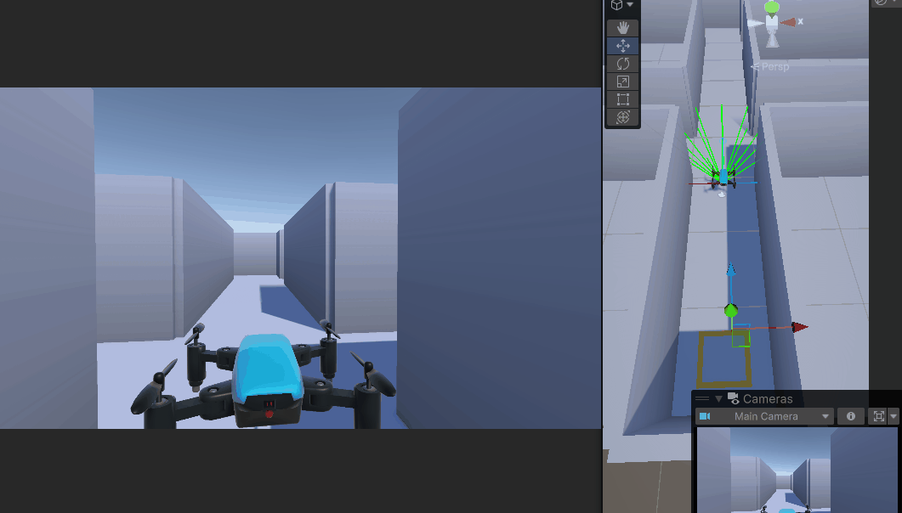
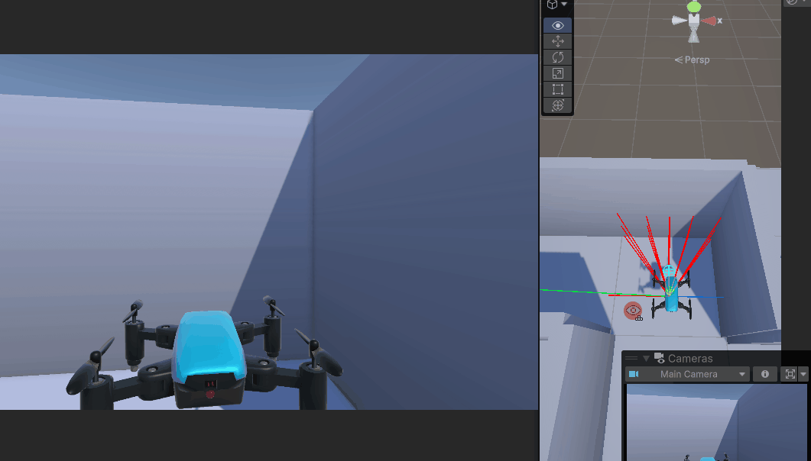
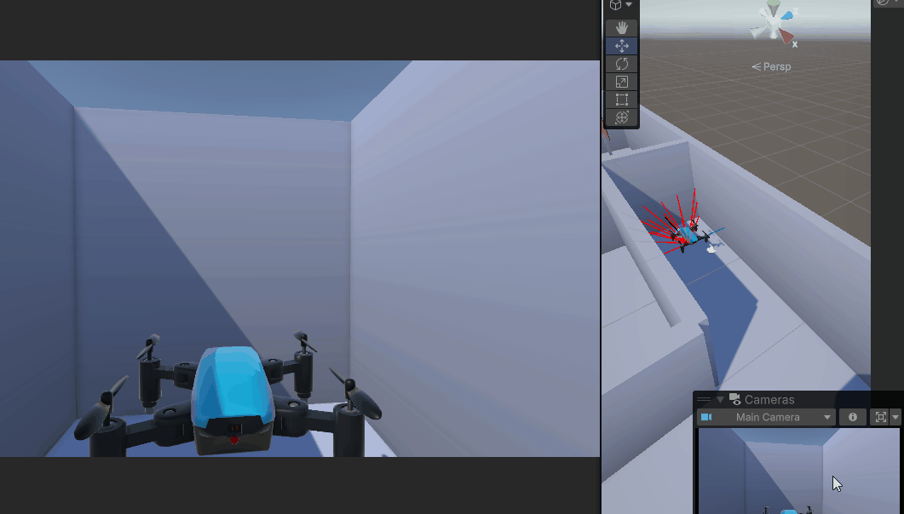

# GPS-Denied Drone Navigation

Game-theoretic approach to autonomous drone navigation in GPS-denied environments using Minimax, Nash Equilibrium, and Bayesian decision-making algorithms.

## 🎯 Overview

This project presents a comprehensive solution for drone navigation when GPS signals are unavailable, modeling the problem as a two-player game between the drone and its environment. Three distinct algorithms are implemented and evaluated across multiple test scenarios.

## 🎬 Unity Simulation Demonstrations

### Simple Navigation

When the path is unobstructed, the drone moves directly toward the goal using efficient straight-line movement.



### Rotation and Direction Change

When encountering obstacles, the drone rotates to assess alternative directions and selects a new path around obstructions.



### Complete Turnaround

When the forward path is completely blocked, the drone executes a full rotation to reverse direction and backtrack efficiently.



## 📹 Project Explanation Video

For a comprehensive walkthrough of the project architecture, algorithms, and Unity simulation, watch the explanation video:

[**Watch Project Explanation** (demonstration/explanation.mp4)](demonstration/explanation.mp4)

This video covers the complete project implementation, game-theoretic approach, and real-time simulation results in Unity.

## �🚀 Quick Start

```bash
cd gps-denied-drone-navigation
python backend/main.py
```

## 🧠 Algorithms

### 1. **Minimax**

- Guarantees worst-case performance
- Fastest computation time (0.072s per decision)
- 100% optimal path efficiency
- Deterministic behavior

### 2. **Nash Equilibrium**

- Finds stable strategy pairs
- Strategic equilibrium approach
- 100% optimal path efficiency
- Moderate computation time (0.092s per decision)

### 3. **Bayesian Game Solver**

- Enables learning under incomplete information
- Adaptive behavior based on belief updates
- 91% path efficiency (9% longer paths for exploration)
- Robust to environmental uncertainty

## ✅ Implemented Components

### 1. **Environment** (`backend/core/environment.py`)

- 20×20 grid system with obstacles
- Position validation and distance calculations
- Goal detection

### 2. **Strategies** (`backend/game_theory/strategies.py`)

- **Drone:** MOVE_UP, MOVE_DOWN, MOVE_LEFT, MOVE_RIGHT, STAY, ROTATE
- **Environment:** CLEAR_PATH, OBSTACLE_AHEAD, LOW_VISIBILITY, SENSOR_NOISE, LIGHTING_CHANGE
- Mixed strategies: Cautious, Aggressive, Balanced, Typical, Adversarial, Favorable

### 3. **Payoff Function** (`backend/game_theory/payoff.py`)

- Returns `(drone_payoff, env_payoff)` tuples
- Four components: mission success, energy, collision risk, map quality
- Action-specific costs: MOVE=5, STAY=1, ROTATE=2
- Directional awareness: 70% penalty for moving away from goal
- Intelligent collision multipliers

### 4. **Logger** (`backend/simulation/logger.py`)

- Step logging: action, position, battery, payoff
- Event logging with metadata
- Export to JSON and CSV

### 5. **Simulation** (`backend/simulation/simulation.py`)

- Pure strategy testing (150 combinations)
- Mixed strategy testing (125 combinations)
- Full payoff matrix display
- Safe probability lookup

## 📊 Results

Successfully tested **275 strategy combinations** with verified correctness:

- Best: Cautious vs Favorable (+2.25 payoff)
- Worst: Custom_Exploration vs Custom_DangerZone (-0.60 payoff)
